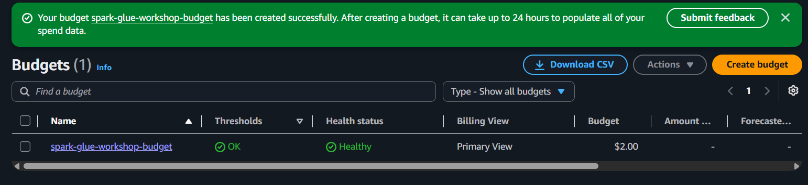
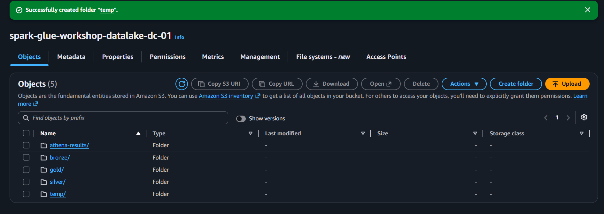
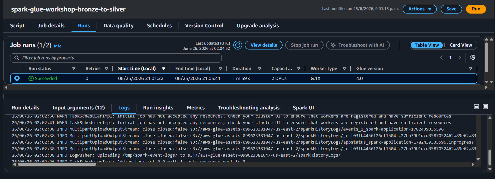
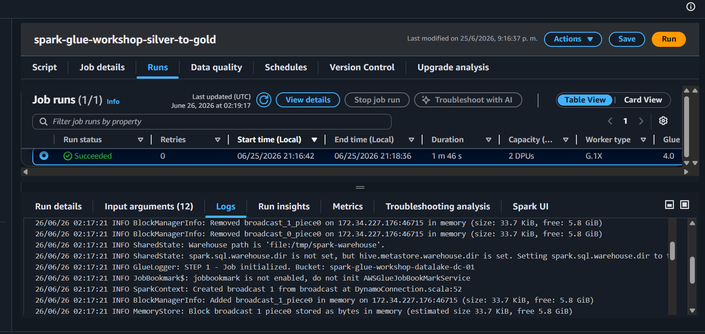
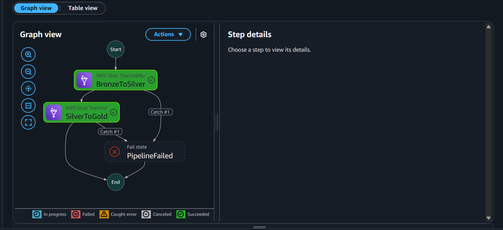
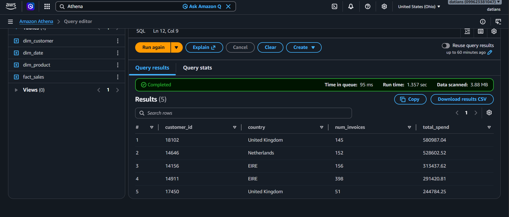

# Spark / AWS Glue Workshop

Pipeline ETL distribuido **Bronze → Silver → Gold** sobre el dataset **Online Retail II**, construido con **AWS Glue Studio**, **Amazon S3**, **AWS Step Functions** y **Amazon Athena**.

## Objetivo del taller

Construir un Data Lake en S3 con arquitectura Medallion:

- **Bronze:** datos crudos en CSV.
- **Silver:** datos limpios, tipados y almacenados en Parquet.
- **Gold:** modelo estrella con dimensiones y tabla de hechos para análisis SQL.

## Estructura del repositorio

```text
spark-glue-workshop/
├── README.md
├── .gitignore
├── data/
│   └── .gitkeep
├── evidence/
│   └── .gitkeep
├── scripts/
│   ├── prepare_csv.py
│   ├── job_bronze_to_silver.py
│   └── job_silver_to_gold.py
├── sql/
│   ├── create_athena_tables.sql
│   └── business_questions.sql
└── step-functions/
    └── state_machine.json
```

## Configuración local

```bash
python -m venv venv

# Windows PowerShell
venv\Scripts\Activate.ps1

# macOS / Linux
source venv/bin/activate

pip install pandas openpyxl
```

## Preparación del dataset

1. Descargar el dataset **Online Retail II** desde Kaggle.
2. Dejar el archivo `online_retail_II.xlsx` dentro de la carpeta `data/`.
3. Ejecutar:

```bash
python scripts/prepare_csv.py
```

Esto genera:

```text
data/online_retail_ii_2009_2010.csv
data/online_retail_ii_2010_2011.csv
```

> Los archivos `.zip`, `.xlsx` y `.csv` no se suben al repositorio porque están ignorados en `.gitignore`.

## Parámetros usados en AWS

- Región recomendada: `us-east-1`
- Proyecto: `spark-glue-workshop`
- Bucket S3: `spark-glue-workshop-datalake-<iniciales>-01`
- Rol IAM para Glue: `spark-glue-workshop-role`
- Job Bronze → Silver: `spark-glue-workshop-bronze-to-silver`
- Job Silver → Gold: `spark-glue-workshop-silver-to-gold`
- Step Function: `spark-glue-workshop-orchestrator`
- Base de datos Athena: `workshop_gold`

## Tags usados

| Key | Value |
|---|---|
| Project | spark-glue-workshop |
| Environment | dev |
| Owner | `<nombre>` |
| Course | parallel-distributed-computing |
| ManagedBy | workshop |

## Evidencia del taller

### Paso 0 — Alerta de presupuesto



Se creó una alerta de presupuesto para controlar el consumo de AWS antes de crear recursos del taller.

### Paso 2 — Bucket S3 con las 5 carpetas



Se creó el bucket del Data Lake con las carpetas `bronze/`, `silver/`, `gold/`, `athena-results/` y `temp/`.

### Paso 5 — Job Bronze → Silver completado



El primer job de Glue leyó los CSV desde `bronze/`, limpió y tipificó los datos, y escribió archivos Parquet particionados por año en `silver/`.

### Paso 6 — Job Silver → Gold completado



El segundo job de Glue transformó Silver en un modelo estrella, generando `dim_product`, `dim_customer`, `dim_date` y `fact_sales` dentro de `gold/`.

### Paso 7 — Orquestación con Step Functions



La Step Function ejecutó automáticamente los jobs `BronzeToSilver` y `SilverToGold`, esperando la finalización de cada uno antes de avanzar.

### Paso 8 — Consultas analíticas en Athena



Athena consultó las tablas externas sobre Parquet en S3 y respondió preguntas de negocio sobre productos, ventas, países y clientes.

## Limpieza de recursos

Al finalizar el taller, eliminar los recursos para evitar costos:

1. Glue jobs.
2. Step Function.
3. Objetos y bucket S3.
4. Roles IAM creados para Glue y Step Functions.
5. Budget si se desea.
